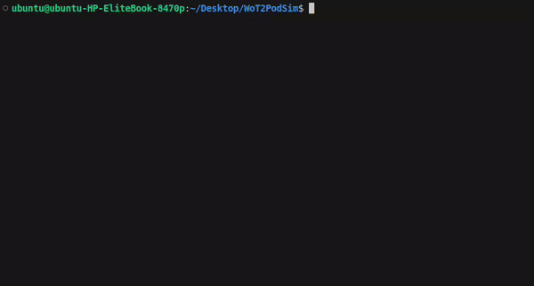

# Latency Simulation
This repository contains a simulation of various data exchange strategies, including polling, pushing, and a hybrid of both. It utilizes virtual Ethernet connections, simulated via Linux network namespaces, to verify the derived equations used for latency prediction. The repository consists of JavaScript files that depict the communication scenarios and shell scripts for the setup and teardown of the simulation.

## Requirements
The software has been tested on Ubuntu 22.04.

The following packages need to be installed:
+ [nvm](https://github.com/nvm-sh/nvm) and Node.js version 16.20.1
+ [openvswitch-switch](https://packages.ubuntu.com/jammy/openvswitch-switch)
+ [openvswitch-common](https://packages.ubuntu.com/jammy/openvswitch-common)

## Installation
To clone the repository, use the following commands:

```bash
git clone https://github.com/FreuMi/WoT2PodSim
cd WoT2PodSim
```
The necessary Node.js packages are already included as some libraries are modified for time measurement purposes.

## Usage
Seven shell scripts are provided: three for establishing the virtual Ethernet connections, three for tearing down the setup, and one to run all other scripts after each other.

- `startPollingTest.sh` initiates a simulation of a polling-based interaction and logs the time spans needed in the equations.
- `startPushingTest.sh` starts a simulation of a pushing-based interaction and logs the time spans needed in the equations.
- `startCombinationTest.sh` starts a simulation that combines polling and pushing interactions, logging the time spans required in the equations.

To sequentially start all simulations, you can use the `startEverything.sh` script.


## Demo

